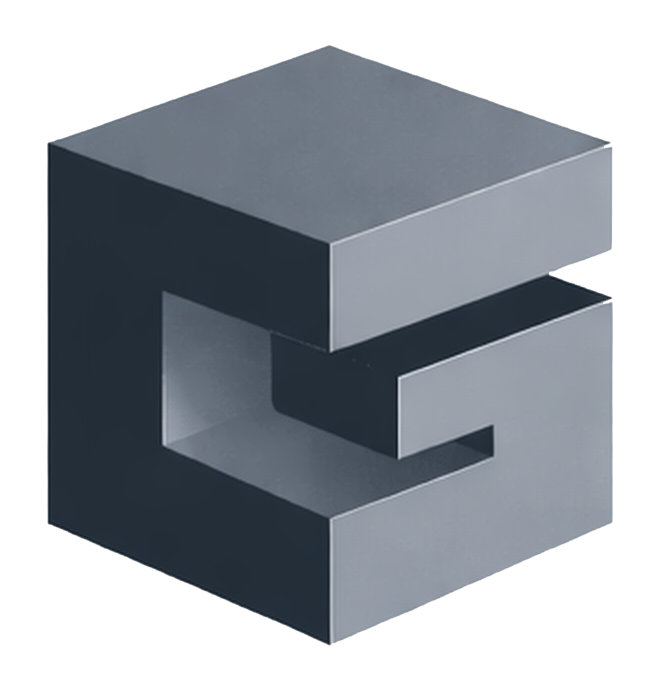

  

<h1 align="center">Graund</h1>

<strong>Base forte. Tecnologia inteligente.</strong>

Construímos software sólido para resolver problemas reais de empresas.

---

## Sobre

A Graund é uma empresa brasileira de desenvolvimento de software fundada por desenvolvedores full-stack e empreendedores.

Nosso foco é construir sistemas confiáveis, escaláveis e bem estruturados, capazes de sustentar operações reais de negócios.

Acreditamos que tecnologia eficiente nasce de três pilares:  
	•	arquitetura bem definida  
	•	código simples e legível  
	•	soluções orientadas ao problema  

  

---

## Stack Principal

- **Backend**: .NET Core (WebAPI, MVC, Razor)
- **Frontend web**: ReactJS, NextJS
- **Frontend desktop**: ElectronJS
- **Banco de dados**: RavenDB, PostgreSQL

---

## 🚀 Projetos em destaque

### <u>App Turístico</u>
Aplicação voltada para moradores e turistas da região, reunindo:  
	•	oportunidades de emprego  
	•	serviços locais  
	•	marketplace regional (em desenvolvimento)  

 

### <u>ERP</u>  
(Em Desenvolvimento)

---

## Open source Fluent

Mantemos projetos open source inspirados no design system Fluent da Microsoft, com foco em componentes reutilizáveis, design tokens e experiências consistentes entre plataformas.

### [fluent2_kit](https://github.com/graundtech/fluent2_kit)

Biblioteca Flutter baseada no Fluent 2, publicada no `pub.dev`, com componentes, tema e tokens para criar interfaces coesas em aplicativos mobile.

### [fluent2-react-kit](https://github.com/graundtech/fluent2-react-kit)

Biblioteca React em desenvolvimento, planejada para publicação no `npm` e distribuição também como registry compatível com `shadcn`, levando a mesma inspiração Fluent para aplicações web.

---

## 💡 Nossa visão

Transformar empresas por meio de software bem‑estruturado, com governança, escalabilidade e foco em produtividade real.  
Open‑source é parte da nossa cultura: apoiamos iniciativas colaborativas e mantemos princípios transparentes.

---

## 📬 Contato

- Email: <em breve>  
- LinkedIn: [Graund on LinkedIn](https://linkedin.com/graundtech)  
- Site institucional: https://graund.tech

---

## 🤝 Participe

Explore nossos repositórios públicos, abra issues, contributa com pull requests e acompanhe nossa evolução!

> _Registro no Simples Nacional e iniciativa admitida no programa Inova Simples._
